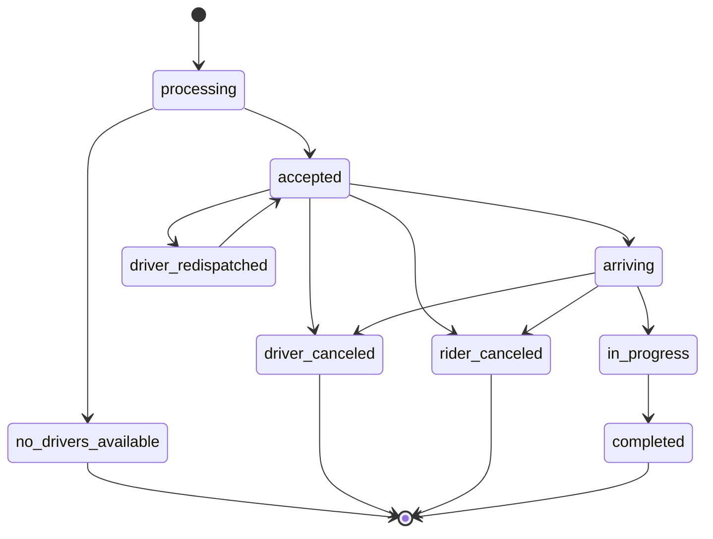
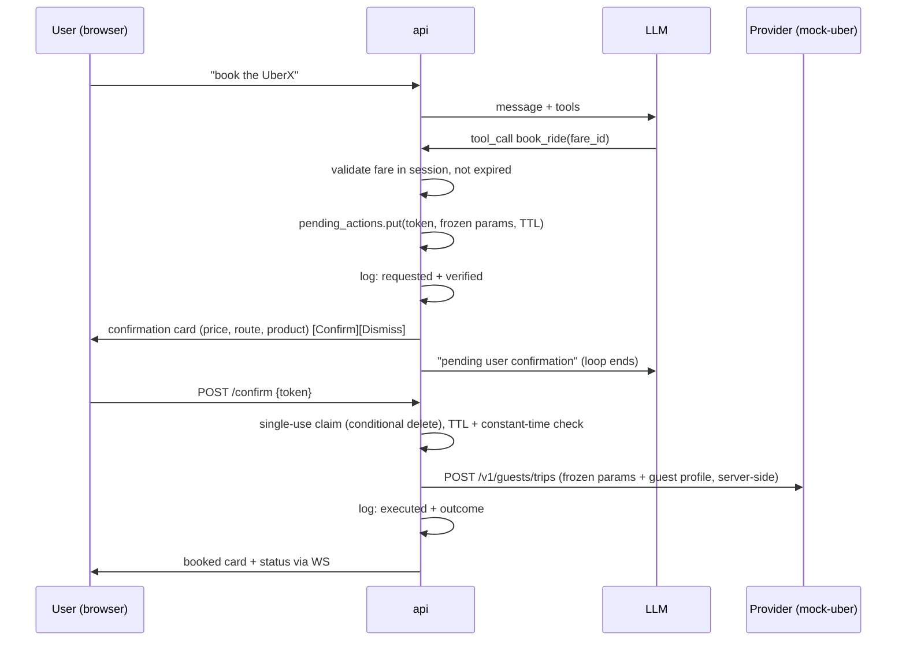

# Route Buddy - RFC & Detailed Design

_Status:_ Approved (design), implementation not started
_Date:_ 2026-07-25
_Author:_ Claude (chief-architect session), decisions by Vincent
_Repository:_ [vince-e10/route-buddy](https://github.com/vince-e10/route-buddy)
_Requirements:_ `docs/high-level-requirements.md` · Live status: `docs/rfc.md` · Agent brief: `AGENTS.md`

## 1. Summary

Route Buddy is an AI agent that books ride-hailing trips end to end: discover options, compare prices, book, track, cancel. MVP targets the Singapore market with Uber as the (mocked) provider, a FastAPI backend, a minimal web chat UI, cheap OpenRouter-hosted LLMs, and a LocalStack-based AWS stack that productionizes without a rewrite. Three invariants are structurally enforced in code, never by prompts: a confirmation gate on every real-world action, an append-only action log of every attempt, and grounded answers only.

`docker compose up` brings the whole system to a working state - that is the definition of done for every phase.

## 2. Goals / Non-goals

**Goals (MVP)**
- Multi-turn chat: search places, quote rides, book (with confirm), live-track, cancel (with confirm)
- The three invariants enforced structurally (see section 8)
- Every external dependency behind a swappable seam (provider, geocoder, LLM)
- One-command bring-up; zero cloud credentials beyond OpenRouter key, LocalStack free token, OneMap token
- Infrastructure as code from day 1 (Terraform), same definitions productionize to AWS
- Highest-security posture within MVP scope: no PII/secret leakage (section 9)

**Non-goals (MVP)**
- Real Uber API calls (partner-gated; see research), Lyft/Grab adapters, plugin registry
- Scheduled/Reserve rides (explicitly cut to keep scope small)
- Multi-user, login, payments UI (single user, no auth; org-pays model mirrors Uber Guest Rides)
- SQS/queueing, WAF, TLS termination (documented production path, not built)

## 3. Research findings (verified 2026-07-25)

### 3.1 Uber API access reality

There is **no self-serve API to book Uber rides for a third party in 2026**. The consumer Rides API is deprecated; the current product is the **Guest Rides API** (Uber for Business suite), which books rides for guests without Uber accounts - but requires a U4B Enterprise relationship and manual partner approval (`guests.trips` scope). Even the sandbox (`sandbox-api.uber.com`) requires whitelisting. This kills the "free Uber sandbox" assumption and motivates the mock-provider decision (4.1).

Contract facts we mirror in the mock (from Uber's public docs):
- `POST /v1/guests/trips/estimates` - products + fares, each with `fare_id`, `expires_at`, fare display, pickup ETA
- `POST /v1/guests/trips` - books; requires `guest.{first_name,last_name,phone_number}`, `product_id`, optional `fare_id` (locks upfront fare); returns `request_id`, `status: "processing"`
- `GET /v1/guests/trips/{request_id}` - status, driver, fare; `DELETE` - cancel
- Webhook `guests.trips.status_changed`: `{event_id, event_time, event_type, resource_href, meta:{resource_id, status, org_uuid}}`
- Auth: OAuth2 client credentials, `authorization: Bearer`, `x-uber-organizationuuid` header
- Trip state machine (forward-only):



### 3.2 LocalStack (2026.03.0+)

- No more anonymous use: requires a free-account `LOCALSTACK_AUTH_TOKEN` env var
- **Persistence is paid-only**: all emulated state wipes on restart. Consequence: infra must be re-applied idempotently at every startup, and local data loss on restart is an accepted MVP limitation (prod DynamoDB is durable)
- Free (Hobby) tier: DynamoDB, SQS, SNS, S3, EventBridge, Lambda, API Gateway. **Paid-only: RDS/Postgres, Secrets Manager** - which rules out Postgres locally and defers Secrets Manager to prod
- Endpoint switching is now SDK-native: set `AWS_ENDPOINT_URL=http://localstack:4566` locally, unset in prod; zero code branching
- Init runs against `/_localstack/health`-gated readiness; Terraform works via the `tflocal` wrapper

### 3.3 OpenRouter and cheap tool-calling models

- OpenAI-compatible `/api/v1/chat/completions` with the standard `tools` schema; `models: [...]` array gives automatic fallback; `provider.require_parameters: true` routes only to upstreams that honor `tools`/`response_format`; **Response Healing** repairs malformed tool-call JSON (a real problem on cheap models); provider data-policy filtering can exclude providers that train on or retain prompts
- Candidates compared (mid-2026 pricing, $/Mtok in/out): GLM-4.5-Air 0.13/0.85 (lightweight sibling of the BFCL v3 leaderboard-topping GLM-4.5), MiniMax M2 0.26/1.02 (agent-purpose-built), DeepSeek V3.2 0.21/0.31, Kimi K2 0.60/2.50 (known trailing-garbage JSON issue via OpenRouter), Qwen3-32B 0.08/0.28 (weakest tool discipline)
- **Selected: `z-ai/glm-4.5-air` primary, `minimax/minimax-m2` fallback.** Escalation path if tool discipline disappoints: route only the write-path turns (book/cancel proposals) to Claude Haiku while keeping cheap models on read paths

Full citations in Appendix A.

### 3.4 OneMap (SG geocoding) - contract verified live 2026-07-25

Official Singapore Land Authority geocoder. Free, no per-call cost. Contract below was verified by
calling the live API, not just reading docs.

**Search endpoint**

```
GET https://www.onemap.gov.sg/api/common/elastic/search
    ?searchVal=<query>&returnGeom=Y&getAddrDetails=Y&pageNum=1
Authorization: <access_token>
```

| Param | Required | Notes |
|---|---|---|
| `searchVal` | yes | Building name, road name, postal code, or landmark |
| `returnGeom` | yes | `Y`/`N` - include coordinates |
| `getAddrDetails` | yes | `Y`/`N` - include address breakdown |
| `pageNum` | no | Defaults to 1; 10 results per page |

Response (verbatim field names, real sample):

```json
{
  "found": 13, "totalNumPages": 2, "pageNum": 1,
  "results": [{
    "SEARCHVAL": "MARINA BAY SANDS",
    "BLK_NO": "1", "ROAD_NAME": "BAYFRONT AVENUE", "BUILDING": "MARINA BAY SANDS",
    "ADDRESS": "1 BAYFRONT AVENUE MARINA BAY SANDS SINGAPORE 018971",
    "POSTAL": "018971",
    "X": "31059.4625855722", "Y": "29543.3804153632",
    "LATITUDE": "1.28345419690844", "LONGITUDE": "103.860809048956"
  }]
}
```

`X`/`Y` are SVY21 projected coordinates (ignore); we use `LATITUDE`/`LONGITUDE`, which map
directly onto the provider's `pickup`/`dropoff` lat-lng objects. Note all values are **strings** -
the adapter parses to float, and a parse failure is a refusal, not a guess.

**Auth**

- Token: `POST https://www.onemap.gov.sg/api/auth/post/getToken` with `{"email", "password"}`,
  returns `access_token` (+ expiry). **Valid ~3 days.**
- Sent as an `Authorization` header on API calls.
- Observed behavior: search currently still returns results without a token but adds
  `"error": "Authentication token missing..."` to the payload; other endpoints (e.g. `revgeocode`)
  hard-fail `401`. **We treat the token as mandatory** - relying on the unauthenticated grace path
  would be building on sand.

Design consequences:
- Credentials (`ONEMAP_EMAIL`, `ONEMAP_PASSWORD`) are secrets: `.env` locally, Secrets Manager in
  prod. The raw token is never logged and never enters model context.
- Token refresh is an implementation-phase task (see section 12): fetch on startup, cache with its
  expiry, refresh on expiry or on a `401`. This is exactly the kind of credential lifecycle the
  `Geocoder` seam keeps out of the rest of the system.
- Reverse geocoding is not needed for MVP (we only resolve user-typed places to coordinates).

## 4. Options considered and decisions

### 4.1 Uber integration

| Option | Pros | Cons | Verdict |
|---|---|---|---|
| Real sandbox | Real contract, zero mock code | Gated behind U4B enterprise approval + whitelisting; blocks MVP on Uber's timeline; creds per dev | No |
| **Mock Guest Rides service** | Zero cost, works for anyone, deterministic tests, we control scenarios (surge, no drivers, cancels) | Fidelity risk if we drift from the real contract | **Selected** - mitigated by mirroring documented paths, field names, states, webhook payloads verbatim |
| Both from day 1 | Ready either way | Double work for an approval we do not have | No (adapter makes "later both" cheap) |

### 4.2 LLM

| Option | Pros | Cons | Verdict |
|---|---|---|---|
| Claude API | Best tool-use discipline | Highest cost | Escalation path only |
| AWS Bedrock | Most AWS-native | LocalStack cannot emulate inference; local dev still hits cloud + needs AWS creds | No |
| **OpenRouter, Chinese models** | Cheapest credible tool calling; model swap = config; automatic fallback | Malformed-JSON risk, provider variance | **Selected** (owner directive; mitigations: Response Healing, `require_parameters`, Pydantic validation, structural gate) |
| Local (Ollama) | Free, offline | Weak tool discipline vs the no-hallucination requirement | No |

### 4.3 Datastore

| Option | Pros | Cons | Verdict |
|---|---|---|---|
| **DynamoDB** | Free in LocalStack; append-only log fits PutItem; TTL native; prod = same code | NoSQL modeling discipline needed | **Selected** |
| Postgres (RDS) | Rich queries | RDS is LocalStack-paid-only; second datastore for no MVP need | No |
| SQLite | Trivial | Not an AWS service; fails productionize-without-rewrite | No |

### 4.4 Status updates, UI transport, geocoding, queue, IaC

| Decision | Selected | Over | Why |
|---|---|---|---|
| Status updates | Webhooks from mock-uber (+ GET-trip reconciliation) | api polls provider | Mirrors real Uber's webhook mechanism exactly, so swap keeps the code path; dedupe on `event_id` |
| UI transport | WebSocket | SSE / polling | Chat needs client-to-server anyway; status push rides the same socket; owner suggestion |
| Geocoding | OneMap behind `Geocoder` seam | Google/Mapbox | Free, official SG source; token registered (see 12 - refresh flow is an implementation item) |
| Queue | None in MVP; SQS in prod path | SQS now | Single consumer, single user; queue is hardening, not need |
| IaC | **Terraform + tflocal** | Shell scripts (not IaC, fails requirement); CDK (cdklocal is LocalStack-paid) | Industry standard, mature free LocalStack support, one definition for local + prod |

## 5. Architecture

```
                    docker compose up  (one command)
┌─────────────────────────────────────────────────────────────────┐
│  Browser ◀──(WebSocket: chat + confirms + live status)──┐       │
│  (static chat page served by api)                       ▼       │
│   ┌─────────┐  tflocal apply   ┌──────────────────────────────┐ │
│   │  iac    │────────────────▶ │          api (FastAPI)       │ │
│   │ (init,  │                  │ agent loop · tools · gate    │ │
│   │ exits)  │                  │ action log · sessions · WS   │ │
│   └────┬────┘                  └───┬───────────┬──────────────┘ │
│        │ creates tables            │           ▲                │
│        ▼                           ▼           │ webhook        │
│   ┌────────────┐             ┌────────────┐    │ (status_changed│
│   │ localstack │◀────────────│ mock-uber  │────┘  + shared     │
│   │ DynamoDB   │  (no - api  │ (FastAPI)  │       secret)      │
│   │ 4 tables   │  only)      │ Guest Rides│                    │
│   └────────────┘             │ + driver   │                    │
│                              │   simulator│                    │
│                              └────────────┘                    │
└───────────────────────┬─────────────────────┬───────────────────┘
                        ▼ external            ▼ external
                  OpenRouter API         SG OneMap API
             (glm-4.5-air → minimax-m2)  (geocoding, token)
```

Containers: **api** (orchestrator + static UI), **mock-uber** (provider simulation), **localstack** (DynamoDB), **iac** (runs `tflocal apply`, exits; api starts on `service_completed_successfully`). Only api publishes a host port; everything else is compose-network-internal. Startup ordering: localstack healthcheck (`/_localstack/health`) -> iac applies -> api starts -> mock-uber independent.

## 6. Component design

### 6.1 api - agent loop and tools

Flow per user message: load session from DynamoDB -> append user message -> call LLM (OpenRouter, tools attached) -> dispatch tool calls -> feed results back -> repeat until assistant text -> persist session -> push over WebSocket.

Tool inventory (the complete set; nothing else is exposed to the model):

| Tool | Type | Does | Grounding source |
|---|---|---|---|
| `search_places(query)` | read | Geocode SG landmarks/postal codes; returns candidate places for the user to disambiguate | OneMap search (3.4) |
| `get_quotes(pickup, dropoff)` | read | Products + fares + ETAs, each with `fare_id` and expiry | Provider estimates |
| `book_ride(fare_id)` | **write, gated** | Never executes; creates pending confirmation | - |
| `get_trip_status(trip_id)` | read | Current trip state, driver, fare | Provider GET trip |
| `list_session_trips()` | read | This session's trips with ids and states | trips table |
| `cancel_ride(trip_id)` | **write, gated** | Never executes; creates pending confirmation | - |

- Tool args validated with Pydantic; unknown tool or invalid args -> refusal returned to the model and logged (`verified: rejected`)
- "Cancel that one" resolution: the session's trip list (explicit ids) is injected into context; the model must pass a concrete `trip_id`; ids are validated against the session before any gate record is created
- LLM client: thin OpenAI-compatible wrapper; config = base URL, key, `models` list, `provider` options (`require_parameters: true`, data-policy deny-retention, Response Healing on). Swapping provider or model touches config only

### 6.2 Confirmation gate (invariant 1)



Rules:
- A write tool call from the model **cannot** execute a provider action on any code path; execution requires a live, unclaimed token arriving on `/confirm`
- Tokens: `secrets.token_urlsafe`, single-use (claimed via DynamoDB conditional write, so a double-click cannot double-book), constant-time compared, parameter-frozen at creation (the exact `fare_id`, route, displayed price; or `trip_id` for cancel)
- Expiry: booking token dies with the quote's `expires_at`; cancel token TTL 2 minutes; expired confirm -> refusal, logged, fresh quote required
- Scope: one token = one action; a price or plan change invalidates nothing silently - it simply requires a new proposal and a new token
- Dismiss -> `outcome: aborted_by_user`, logged
- No skip-confirmation flag, no auto-confirm timeout, no agent-inferred approval - by policy (AGENTS.md) and by structure (no code path)

### 6.3 Action log (invariant 2)

Every attempt gets a `correlation_id` and appends phase entries to the `action_log` table (append-only; the repository class exposes only `append`, no update/delete):

| Phase | Records |
|---|---|
| `requested` | Tool + args as the model proposed them |
| `verified` | Validation/gate outcome (ok, rejected: reason, token created) |
| `executed` | Provider request actually sent (endpoint, params) |
| `outcome` | Provider response / error / refusal / aborted confirmation / expired token / duplicate webhook |

Read tools log `requested` + `outcome`; gated tools log all four phases across their two-step lifecycle. Webhook receipts and WS pushes of state changes are also appended. A silent action is a bug.

### 6.4 mock-uber - provider simulation

FastAPI service implementing the Guest Rides surface with verbatim paths, field names, and status values:

| Endpoint | Behavior |
|---|---|
| `POST /v1/guests/trips/estimates` | 2-4 SG products (UberX, Comfort, XL) with plausible SGD fares by haversine distance, `fare_id` + `expires_at` (5 min), pickup ETAs; optional surge multiplier |
| `POST /v1/guests/trips` | Validates `fare_id` freshness + guest fields; returns `request_id`, `status: processing`; starts lifecycle simulation |
| `GET /v1/guests/trips/{id}` | Current state incl. simulated driver `{name, rating}` once accepted |
| `DELETE /v1/guests/trips/{id}` | Cancels if in a cancellable state -> `rider_canceled` |
| `POST /_sim/scenario` | Test/demo control (non-Uber namespace): force `no_drivers_available`, `driver_canceled`, surge, timing overrides |

- Lifecycle simulator: async task per trip walks the documented state machine on configurable timers (`SIM_SPEED` env; deterministic instant mode for tests); each transition POSTs a `guests.trips.status_changed` webhook (real payload shape, `event_id` per event, shared-secret header) to the api
- Requires `authorization: Bearer` + `x-uber-organizationuuid` headers (any values accepted) so the adapter exercises the real auth plumbing
- PUT update, receipts, driver messaging, tips, scheduled/Reserve rides: out of scope (Reserve cut by owner decision)

### 6.5 Storage - DynamoDB data model

| Table | Keys | Attributes | TTL |
|---|---|---|---|
| `sessions` | PK `session_id` | messages (capped window), guest profile ref, created/updated | 24 h |
| `trips` | PK `trip_id`; GSI `session_id` | provider, provider request_id, status, quote snapshot, last `event_id`, timestamps | none (MVP) |
| `action_log` | PK `session_id`, SK `ts#seq` | correlation_id, phase, tool, args, outcome | none |
| `pending_actions` | PK `token` | session_id, action type, frozen params, created | quote expiry / 2 min |

- `session_id`: browser-generated UUID persisted in localStorage (single user, no login)
- Guest profile (name, phone for the booking contract): from `.env` demo identity, attached only server-side at execution time - never enters the model context
- Webhook idempotency: transition applied via conditional write keyed on `event_id` + legal state transition; duplicates ignored and logged as duplicates

### 6.6 Infrastructure as code

- `infra/modules/data`: DynamoDB tables, GSIs, TTLs - the one source of truth for infrastructure
- Local: `iac` container runs `tflocal apply` at startup; **tfstate is ephemeral inside the container** - every `docker compose up` is a clean apply against a fresh LocalStack, so state never drifts from LocalStack's wiped reality
- Prod: same module, prod tfvars; prod-only modules (ECS/Fargate, ALB + TLS, VPC/SGs, least-privilege IAM task roles, Secrets Manager, CloudWatch) added at productionization; **remote encrypted state backend with locking** (S3 + lock table); Terraform manages Secrets Manager resource shells only - values injected out-of-band so no secret lands in tfstate

### 6.7 Frontend - static chat page

Single `index.html` (vanilla JS) served by the api container. WebSocket protocol (JSON messages): `user_msg`, `assistant_msg`, `confirmation_request` (renders card with Confirm/Dismiss -> POST `/confirm`), `trip_update` (live status card from structured data), `error`. Quotes render as selectable cards from tool output - prices, ETAs, and states shown in the UI always come from structured data, never model prose. No framework, no build step.

## 7. Swappable seams (the flexibility requirement)

Three small interfaces, each with exactly one implementation. The interface is the seam; no plugin registry, no Lyft/Grab stubs (YAGNI per AGENTS.md).

```python
class RideProvider(Protocol):
    async def get_quotes(self, pickup: LatLng, dropoff: LatLng) -> list[Quote]: ...
    async def book(self, fare_id: str, guest: GuestProfile) -> Trip: ...
    async def get_trip(self, trip_id: str) -> Trip: ...
    async def cancel(self, trip_id: str) -> Trip: ...

class Geocoder(Protocol):
    async def search(self, query: str) -> list[Place]: ...
```

- `UberAdapter` implements `RideProvider`; base URL + credentials are env config -> mock-uber locally, real Guest Rides later with the same code
- `OneMapGeocoder` implements `Geocoder` (contract in 3.4): maps `results[]` to `Place(name=SEARCHVAL, address=ADDRESS, postal=POSTAL, lat=float(LATITUDE), lng=float(LONGITUDE))`, owns token fetch/cache/refresh internally, returns the first page only (10 results, ample for disambiguation). Stub used in tests - no OneMap calls in the test suite
- LLM: OpenAI-compatible client; base URL + model list are config -> OpenRouter today, any compatible endpoint (incl. Bedrock gateways or Anthropic-compatible proxies) later
- Adding Lyft/Grab = one new adapter class + quote normalization into the same `Quote` model; nothing upstream changes

## 8. The three invariants - enforcement map

| Invariant | Enforced by |
|---|---|
| Confirmation gate | Structure: write tools have no execution path; only `/confirm` with a live single-use token executes (6.2) |
| Action log | Append-only repository (no update/delete methods); every phase of every attempt including refusals and aborts (6.3) |
| Grounded answers | UI renders prices/ETAs/states from structured tool output only; trip references resolve against the session trip list, not model memory; invalid tool calls refused + logged; system prompt restricts to tool results (defense-in-depth, not the mechanism) |

## 9. Security design

| Surface | Mitigation |
|---|---|
| Secrets | Gitignored `.env` only (OpenRouter key, LocalStack token, webhook secret, OneMap email/password); committed `.env.example` with names + empty values; `.dockerignore` excludes `.env`; never in code, git, images, logs, model context, or error messages. Prod: Secrets Manager + IAM task roles, no long-lived keys |
| PII to LLM | **The model never sees PII.** Guest name/phone attached server-side only inside confirm-execution; the model handles places, coordinates, quotes, trip ids. OpenRouter provider routing denies data-retention/training providers |
| Logs | Action log = access-controlled audit (full fidelity, no public endpoint, IAM-only in prod). App logs = structured JSON through a redaction filter: regex list (phone/email patterns) + exact-match masking of loaded secret env values. Tokens travel in POST bodies, never URLs |
| Network | Only api publishes a host port; mock-uber/localstack compose-internal. Webhook: shared-secret header, constant-time compare (prod: real signature verification) |
| App | Pydantic at every trust boundary (user input, model tool calls, webhooks, confirms); token properties per 6.2; rate limiting on chat + confirm; same-origin CORS; security headers on static page |
| Prompt injection | External text (user, OneMap names, provider data) is data, never instructions; real-world actions sit behind the human confirm gate, so injection cannot book or cancel - prompt hardening is defense-in-depth only |
| Supply chain | Pinned deps (lock file), `python:3.12-slim`, non-root containers, no secrets in layers; pip-audit + trivy in CI (prod path) |
| Data at rest | TTLs bound PII retention (sessions, pending_actions); DynamoDB encryption at rest in prod; action-log retention policy = production decision (open question) |

**MVP vs prod honesty** - built now: everything above except Secrets Manager (LocalStack-paid; `.env` locally), TLS (ALB concern), IAM enforcement (LocalStack ignores authz), infra-level WAF/rate limits, scanning CI. Those are documented prod-path Terraform items, not faked locally.

## 10. Testing strategy

- **Gate unit tests** (highest value): single-use claim under double-submit, TTL expiry, parameter freezing, constant-time compare, dismiss/abort logging
- **Agent-loop tests**: scripted fake LLM (deterministic tool-call sequences) - no OpenRouter in tests; asserts tool dispatch, refusal of invalid calls, gate interception of write tools, log phases
- **Adapter integration**: `UberAdapter` against mock-uber in deterministic mode (instant transitions); full lifecycle incl. webhook receipt, dedupe, cancel fee-free path
- **Mock-uber self-tests**: state machine legality (no illegal transitions), scenario knobs
- Rule (AGENTS.md): never call real Uber from tests. No test scaffolding beyond what these need

## 11. Known MVP limitations (accepted, explicit)

1. **Local data wipes on restart** - LocalStack free tier has no persistence; tables re-created by `iac` on every up. The action log is therefore durable only in prod (real DynamoDB). Accepted for local dev
2. Webhook auth is a shared secret, not signatures - prod item
3. Single region/market (SG), single user, English-first prompts
4. Model may occasionally produce a malformed tool call despite mitigations - the failure mode is a logged refusal and a re-ask, never an unintended action (the gate guarantees this)

## 12. Open questions / deferred to implementation

| Item | Owner | Note |
|---|---|---|
| OneMap token refresh | Implementor | Token registered (Vincent); expires ~3 days. Implementor builds the refresh flow inside `OneMapGeocoder`: `POST /api/auth/post/getToken` with `.env` credentials, cache with expiry, re-fetch on expiry or `401` (contract in 3.4). Not a design blocker |
| Action-log retention policy | Production decision | Audit-vs-privacy trade-off; revisit at productionization |
| Uber partner approval | Vincent/business | Required before real-provider swap; timeline unknown |
| Model quality gate | Implementor | If GLM-4.5-Air tool discipline disappoints in practice, flip write-path turns to Claude Haiku (config), keep cheap reads |

## 13. Delivery plan

Each phase ends with `docker compose up` green - a broken compose is not done.

| Phase | Scope | Exit criteria |
|---|---|---|
| 0. Skeleton | compose + localstack + `iac` (Terraform tables) + healthchecks; api and mock-uber hello endpoints; `.env.example` | One command up; tables exist; health endpoints green |
| 1. Provider | mock-uber full contract + simulator + webhooks + scenario knobs; `UberAdapter`; deterministic mode | Adapter integration tests pass; full lifecycle observable |
| 2. Data + tools | Storage repositories (4 tables), action-log discipline, `OneMapGeocoder`, read tools | Read tools return grounded data; every attempt logged |
| 3. Agent + gate | LLM client (OpenRouter), agent loop, write tools + confirmation gate, WS protocol, chat UI | End-to-end: search -> quote -> confirm -> book -> track -> cancel in browser; gate tests pass |
| 4. Hardening | Redaction filter, rate limits, security headers, README + demo script, limitation docs | Security checklist (section 9 MVP items) verified; demo runbook works cold |

Repo layout (target):

```
route-buddy/
  docker-compose.yml        .env.example        AGENTS.md  CLAUDE.md
  docs/       high-level-requirements.md, design.md (this file), rfc.md
  api/        Dockerfile, app/{main,agent/,tools/,gate,providers/,geocode/,storage/,logging}, static/index.html, tests/
  mock-uber/  Dockerfile, app/{main,sim,models}, tests/
  infra/      modules/data/*.tf, local/main.tf
```

## Appendix A - key research citations

- Uber: [Guest Rides intro](https://developer.uber.com/docs/guest-rides/introduction) · [Estimates](https://developer.uber.com/docs/guest-rides/references/api/v1/guest-trips-estimates-post) · [Create trip](https://developer.uber.com/docs/guest-rides/references/api/v1/guest-trips-post) · [Status webhook](https://developer.uber.com/docs/guest-rides/references/api/webhooks/status-changed) · [Dispatch & cancellation](https://developer.uber.com/docs/guest-rides/guest-ride-api-build-guide/dispatch-and-cancellation) · [Sandbox](https://developer.uber.com/docs/guest-rides/guides/sandbox)
- LocalStack: [2026.03.0 release](https://blog.localstack.cloud/localstack-for-aws-release-2026-03-0/) · [Pricing](https://www.localstack.cloud/pricing) · [Persistence](https://docs.localstack.cloud/aws/developer-tools/snapshots/persistence/) · [Init hooks](https://docs.localstack.cloud/aws/capabilities/config/initialization-hooks/)
- OneMap: [Search API docs](https://www.onemap.gov.sg/apidocs/search) · [Token management](https://www.onemap.gov.sg/apidocs/docs/tokenmanagement) (contract in 3.4 verified by live calls 2026-07-25, since the docs site is a JS app that cannot be fetched as text)
- OpenRouter: [Provider routing](https://openrouter.ai/docs/guides/routing/provider-selection) · [Structured outputs](https://openrouter.ai/docs/guides/features/structured-outputs) · [Response Healing](https://openrouter.ai/docs/guides/features/plugins/response-healing) · [Exacto](https://openrouter.ai/blog/announcements/provider-variance-introducing-exacto/) · [GLM-4.5-Air](https://openrouter.ai/z-ai/glm-4.5-air) · [MiniMax M2](https://openrouter.ai/minimax/minimax-m2) · [Rate limits](https://openrouter.ai/docs/api_reference/limits)
